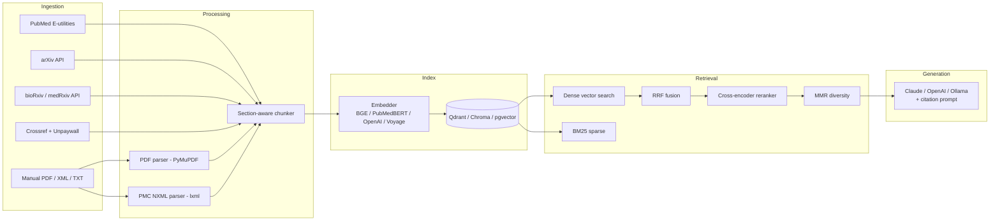

# medlit — vectorized medical literature RAG

`medlit` ingests biomedical papers from PubMed/PMC, arXiv, bioRxiv/medRxiv, and
local files; chunks them with section awareness; embeds them with
biomedical-tuned encoders; stores them in Qdrant; and answers questions with
hybrid retrieval, cross-encoder reranking, and a Claude-grounded generator
that cites every claim inline.

> Designed for research workflows where every answer must be traceable back to
> a specific PMID, DOI, or arXiv ID and where evidence quality
> (RCT vs. cohort vs. case report) matters.

## Architecture



## Quickstart

### 1. Install

```bash
pip install -e ".[dev]"           # core + tests
pip install -e ".[openai,voyage]" # alternative embedders/generators
```

### 2. Configure

```bash
cp .env.example .env
# Edit .env — at minimum set NCBI_EMAIL and ANTHROPIC_API_KEY.
# Set NCBI_API_KEY too (10 req/s vs 3).
```

### 3. Start Qdrant

```bash
docker compose up -d qdrant
```

### 4. Ingest papers

```bash
# PubMed (the primary source). Pulls abstracts + open-access full text.
medlit ingest pubmed --query "CRISPR base editing" --max-results 100 --date-from 2023-01-01

# A single PDF
medlit ingest file path/to/paper.pdf

# By DOI (Crossref metadata + Unpaywall full text if open access)
medlit ingest doi 10.1038/s41586-023-06547-x

# arXiv preprints
medlit ingest arxiv --query "cat:q-bio.QM AND CRISPR"

# bioRxiv / medRxiv (last 30 days by default)
medlit ingest biorxiv --query "base editing" --server biorxiv
```

### 5. Search & ask

```bash
medlit search "off-target effects of base editors" --top-k 10

medlit ask "What are the main delivery methods for CRISPR therapeutics in vivo?"

medlit stats
```

### 6. Or run the API

```bash
medlit serve            # uvicorn at :8000
# or via docker compose
docker compose up api
```

OpenAPI docs at http://localhost:8000/docs.

```bash
curl -X POST http://localhost:8000/search \
  -H 'content-type: application/json' \
  -d '{"query": "adenine base editor off-target", "top_k": 5}'

curl -N -X POST http://localhost:8000/ask \
  -H 'content-type: application/json' \
  -d '{"question": "What are common LNP formulations for mRNA delivery?"}'
```

The `/ask` endpoint emits Server-Sent Events: a `sources` frame with the
retrieved chunks, then a stream of `token` frames, then `done`.

## Configuration

Layered: `config/default.yaml` is the baseline; `.env` (loaded by
`pydantic-settings`) overrides. Key knobs:

| Var / setting | Default | Notes |
|---|---|---|
| `MEDLIT_EMBEDDING_BACKEND` | `sentence_transformers` | also `openai`, `voyage` |
| `MEDLIT_EMBEDDING_MODEL` | `BAAI/bge-large-en-v1.5` | try `pritamdeka/S-PubMedBert-MS-MARCO` for biomedical |
| `MEDLIT_VECTOR_BACKEND` | `qdrant` | also `chroma`, `pgvector` |
| `MEDLIT_GENERATION_BACKEND` | `anthropic` | also `openai`, `ollama` |
| `MEDLIT_GENERATION_MODEL` | `claude-sonnet-4-5` | also `claude-opus-4-5`, `claude-haiku-4-5` |
| `retrieval.use_mmr` | `false` | enable MMR for diversity |
| `reranker.enabled` | `true` | disable to skip the cross-encoder step |
| `chunking.chunk_size` | 512 (tokens) | with 50-token overlap |

## Watches (scheduled re-ingestion)

`config/watches.yaml` defines saved queries that re-pull on a schedule
(daily / weekly / cron). De-duplication is automatic by DOI/PMID.

```yaml
watches:
  - name: crispr-base-editing
    source: pubmed
    query: "CRISPR base editing"
    max_results: 200
    schedule:
      cron: "0 6 * * *"
    filters:
      date_window_days: 30
```

Run the scheduler:

```bash
python -m medlit.scheduler.watches
```

## Copyright & terms of service

- Always sends NCBI `tool` and `email` parameters; uses your API key when
  present (raising the rate limit from 3 to 10 req/s).
- Full-text retrieval is **only** attempted from open-access sources:
  the PMC OA subset, bioRxiv/medRxiv, arXiv, and Unpaywall green/gold OA.
  For closed-access papers, `medlit` stores the abstract and the publisher URL.

## Project layout

```
src/medlit/
  ingestion/      # PubMed, arXiv, bioRxiv/medRxiv, Crossref+Unpaywall, manual
  processing/     # PDF parser (PyMuPDF), PMC XML, section-aware chunker
  embeddings/     # ST / OpenAI / Voyage backends + on-disk cache
  storage/        # Qdrant / Chroma / pgvector behind a common ABC
  retrieval/      # Hybrid dense+sparse, RRF, cross-encoder reranker, MMR
  generation/     # Anthropic / OpenAI / Ollama with citation-enforcing prompt
  api/            # FastAPI app, async ingestion jobs, SSE streaming /ask
  cli/            # typer entry points
  scheduler/      # APScheduler watches
  utils/          # rate-limited HTTP, dedup
  pipeline.py     # End-to-end ingest → chunk → embed → upsert orchestration
config/           # default.yaml, watches.yaml
tests/            # pytest with mocked HTTP via respx
```

## Frontend

The primary surfaces are the CLI (`medlit`) and the FastAPI REST/SSE API.
A **Streamlit** app is also bundled (`streamlit_app.py`) for one-click
deploys to [Streamlit Community Cloud](https://share.streamlit.io). The
Streamlit build is tuned for the 1 GB free tier: OpenAI embeddings,
ChromaDB vector store (no Qdrant container needed), reranker disabled,
Anthropic Claude for generation.

### Deploy to Streamlit Cloud (works from a phone)

1. Push this branch to GitHub (already done).
2. On your phone, go to **share.streamlit.io** → sign in with GitHub.
3. *New app*:
   - Repository: `Rodrigo-Coloma/sagebase`
   - Branch: `claude/medical-literature-rag-nfmts`
   - Main file path: `streamlit_app.py`
4. *Advanced settings → Secrets*: paste at minimum
   ```toml
   OPENAI_API_KEY = "sk-..."
   ANTHROPIC_API_KEY = "sk-ant-..."
   NCBI_EMAIL = "you@example.com"
   UNPAYWALL_EMAIL = "you@example.com"
   ```
   (full template: `.streamlit/secrets.toml.example`)
5. *Deploy*. First boot takes ~3 min while it builds the wheel cache.

### Run the Streamlit app locally

```bash
pip install -r requirements.txt
cp .streamlit/secrets.toml.example .streamlit/secrets.toml  # then edit
streamlit run streamlit_app.py
```

The app has three tabs:
- **Ask** — RAG with streamed Claude tokens and source list above the answer.
- **Search** — hybrid retrieval with optional MMR diversity and journal filter.
- **Ingest** — PubMed search, bioRxiv/medRxiv, DOI lookup, or PDF/XML/TXT upload.

> **Note on persistence**: ChromaDB writes to `./data/chroma` in the
> Streamlit Cloud container, which is wiped when the app reboots. For
> durable storage across reboots, set `QDRANT_URL` to a Qdrant Cloud
> cluster — `medlit` will switch backends automatically.

## Development

```bash
pip install -e ".[dev]"
ruff check src tests
mypy src
pytest
```

## License

MIT.
